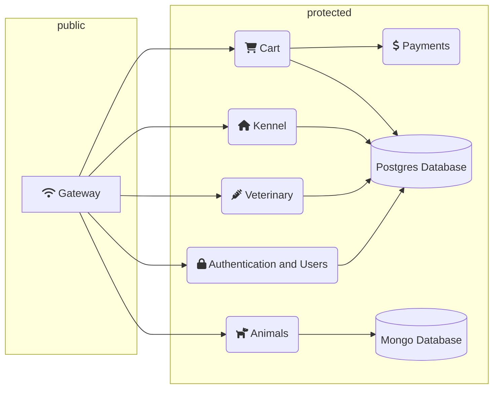

# Kennel-management SaaS

The goal of this project is to create the backend for a Kennel-management
**Software as a Service**.

It has been created by a group of 5 students:
- Johanna: Team lead and veterinary micro-service developer ([Github](https://github.com/JohannaStoicanescu))
- Athénaïs: kennel micro-service developer ([Github](https://github.com/Athe03))
- Paul: Cart and payment micro-services developer and Docker specialist ([Github](https://github.com/paul-ohl))
- Mahylan: Gateway micro-service developer ([Github](https://github.com/Mahylanv))
- Océane: Users and authentication micro-service developer ([Github](https://github.com/GLANEUX))

## Setting up the project

The whole project is built using the `docker-compose.yml` file located at the
root.

Here are the steps to follow to start the services:
```bash
cp .env.example .env
nano .env # edit the variables to your own values
docker compose up
```

There are no dependencies except docker compose. You don't need to install node
or npm.

## Usage

TODO.

## Architecture

As previously stated, the project uses a micro-service architecture. This
allows the different services to *scale* independently (aka. they can adapt to
a change in load).

This is what the different services look like linked to each other:


Although multiple services are connected to the same Postgresql instance,
**they all use different databases**.
